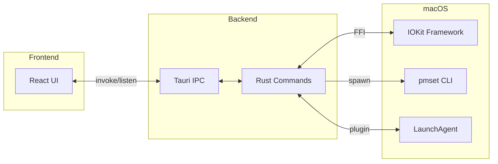
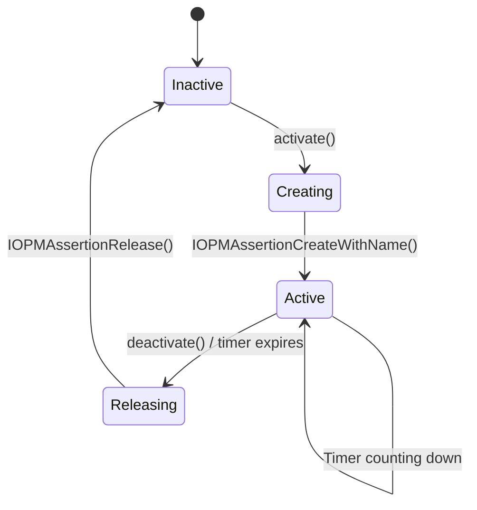
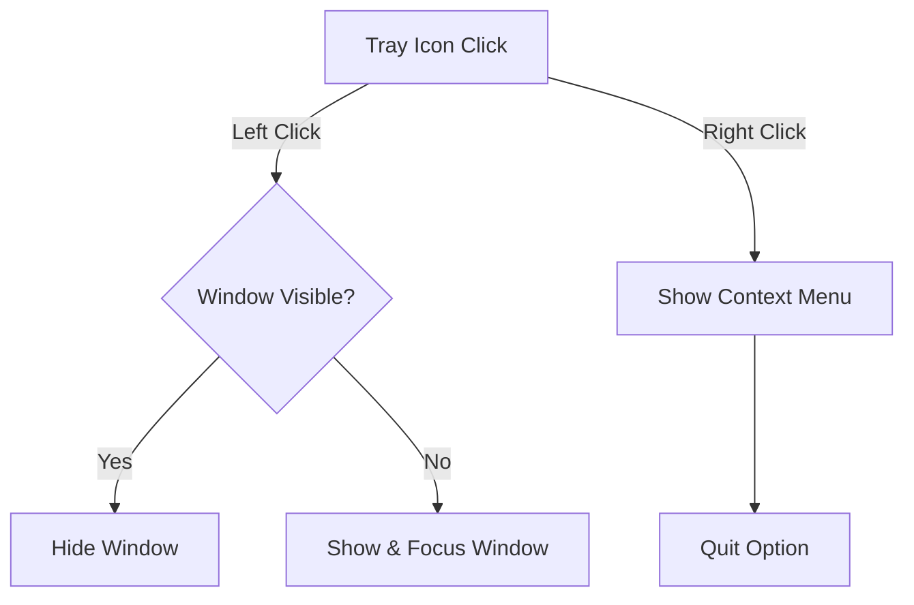
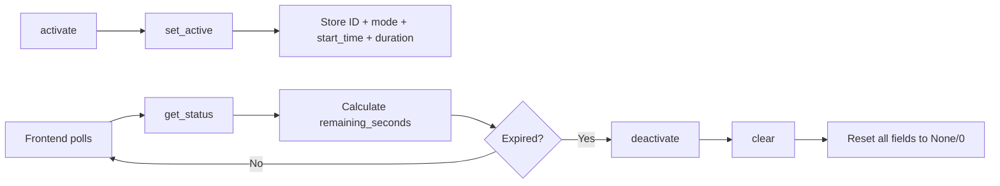

# Caffeinator Internals

Developer documentation for how Caffeinator interacts with macOS system APIs.

## Architecture

Caffeinator is a Tauri v2 application with a Rust backend and React frontend.



## Sleep Prevention

The core feature uses macOS IOKit framework to create power assertions that prevent sleep.

### IOKit FFI Bindings

**File:** `src-tauri/src/power.rs`

```rust
#[link(name = "IOKit", kind = "framework")]
extern "C" {
    fn IOPMAssertionCreateWithName(
        assertion_type: CFStringRef,    // Type of assertion
        assertion_level: u32,           // Level (255 = ON)
        assertion_name: CFStringRef,    // Reason string
        assertion_id: *mut u32,         // Output: assertion ID
    ) -> i32;                           // 0 = success

    fn IOPMAssertionRelease(assertion_id: u32) -> i32;
}
```

### Constants

| Constant | Value | Description |
|----------|-------|-------------|
| `K_IOPM_ASSERTION_LEVEL_ON` | `255` | Assertion is active |
| `kIOReturnSuccess` | `0` | Operation succeeded |

### Assertion Types

| Mode | IOKit Assertion | Description |
|------|-----------------|-------------|
| Idle | `PreventUserIdleSystemSleep` | Prevents idle sleep, user can still force sleep |
| Display | `PreventUserIdleDisplaySleep` | Keeps display awake |
| System | `PreventSystemSleep` | Prevents all system sleep |
| Network | `NetworkClientActive` | Network activity mode |
| Background | `BackgroundTask` | Background task mode |

### Assertion Lifecycle



### Thread Safety

- Global atomic `CURRENT_ASSERTION_ID: AtomicU32` stores the active assertion
- Uses `Ordering::SeqCst` for sequential consistency across threads
- Only one assertion can be active at a time (single-assertion model)

### Error Handling

```rust
// Create returns Result<u32, String>
if result == 0 {
    CURRENT_ASSERTION_ID.store(assertion_id, Ordering::SeqCst);
    Ok(assertion_id)
} else {
    Err(format!("Failed to create power assertion: error code {}", result))
}

// Release is idempotent - releasing ID 0 is a no-op
if assertion_id == 0 {
    return Ok(());
}
```

### Common IOKit Error Codes

| Code | Meaning |
|------|---------|
| `0` | Success |
| `0xe00002bc` | Invalid argument |
| `0xe00002c2` | No memory |

## Power Profile Querying

**File:** `src-tauri/src/power.rs`

Queries current power settings using system commands:

```bash
pmset -g              # Get power settings
pmset -g assertions   # List active assertions
```

**Parsed into:**
```rust
pub struct PowerProfile {
    pub source: String,              // "AC Power" or "Battery"
    pub display_sleep: Option<u32>,  // Minutes
    pub disk_sleep: Option<u32>,     // Minutes
    pub system_sleep: Option<u32>,   // Minutes
    pub assertions: Vec<String>,     // Active assertions
}
```

## Menu Bar Integration

**File:** `src-tauri/src/lib.rs`

### Tray Setup

```rust
TrayIconBuilder::with_id("tray")
    .icon(Image::from_bytes(include_bytes!("../icons/32x32.png")))
    .icon_as_template(true)      // macOS auto-colorizes
    .show_menu_on_left_click(false)
    .menu(&menu)
    .on_tray_icon_event(handler)
```

### Click Handling



### Dynamic Title Updates

The tray title shows remaining time:
- `2:30` for hours:minutes
- `45m` for minutes only
- Empty when inactive

Updated every second via frontend polling.

## Window Management

**File:** `src-tauri/tauri.conf.json`

| Property | Value | Purpose |
|----------|-------|---------|
| `visible` | `false` | Hidden by default |
| `decorations` | `false` | No title bar |
| `transparent` | `true` | Transparent background |
| `skipTaskbar` | `true` | Not in Dock |
| `alwaysOnTop` | `true` | Stays above other windows |

### Dock Hiding

```rust
#[cfg(target_os = "macos")]
app.set_activation_policy(tauri::ActivationPolicy::Accessory);
```

This makes the app a menu bar utility without a Dock icon.

## Launch at Login

**File:** `src-tauri/src/lib.rs`

Uses `tauri-plugin-autostart`:

```rust
.plugin(tauri_plugin_autostart::init(
    MacosLauncher::LaunchAgent,
    Some(vec!["--minimized"]),
))
```

**Creates plist at:**
```
~/Library/LaunchAgents/com.tasnimzotder.caffeinator.plist
```

## State Management

**File:** `src-tauri/src/state.rs`

### AppState Structure

```rust
pub struct AppState {
    pub assertion_id: Mutex<u32>,              // Active IOKit assertion ID (0 = none)
    pub mode: Mutex<Option<AssertionType>>,    // Current sleep prevention mode
    pub start_time: Mutex<Option<Instant>>,    // When caffeination started
    pub duration: Mutex<Option<Duration>>,     // Requested duration (None = indefinite)
}
```

### State Flow



### Duration Calculation

```rust
let remaining = match (start_time, duration) {
    (Some(start), Some(dur)) => {
        let elapsed = start.elapsed();
        if elapsed >= dur { Some(0) }
        else { Some((dur - elapsed).as_secs()) }
    }
    _ => None,  // Indefinite mode
};
```

---

## API Reference

### Rust Functions (`power.rs`)

| Function | Signature | Description |
|----------|-----------|-------------|
| `create_assertion` | `(AssertionType, &str) -> Result<u32, String>` | Creates IOKit assertion |
| `release_assertion` | `(u32) -> Result<(), String>` | Releases assertion by ID |
| `get_power_profile` | `() -> Result<PowerProfile, String>` | Queries pmset |

### AppState Methods (`state.rs`)

| Method | Description |
|--------|-------------|
| `get_status()` | Returns `CaffeinateStatus` for IPC |
| `set_active(id, mode, duration)` | Activates with optional duration |
| `clear()` | Resets all state fields |
| `is_expired()` | Returns true if timer has elapsed |

### IPC Commands (`commands.rs`)

| Command | Parameters | Returns | Description |
|---------|-----------|---------|-------------|
| `activate` | `mode`, `duration_secs` | `Result<()>` | Create power assertion |
| `deactivate` | - | `Result<()>` | Release assertion |
| `get_status` | - | `CaffeinateStatus` | Current state & remaining time |
| `toggle` | `mode`, `duration_secs` | `Result<bool>` | Toggle on/off |
| `update_tray_title` | `title` | `Result<()>` | Update menu bar text |
| `get_power_profile` | - | `Result<PowerProfile>` | Query pmset |
| `quit_app` | - | `()` | Clean exit |
| `get_autostart_enabled` | - | `Result<bool>` | Check login item |
| `set_autostart_enabled` | `enabled` | `Result<()>` | Set login item |

### TypeScript Types

```typescript
type AssertionType =
  | "NoIdleSleep"
  | "NoDisplaySleep"
  | "PreventSystemSleep"
  | "NetworkActive"
  | "BackgroundTask";

interface CaffeinateStatus {
  is_active: boolean;
  mode: AssertionType | null;
  remaining_seconds: number | null;  // null = indefinite
  total_seconds: number | null;
}
```

---

## File Reference

| File | Purpose |
|------|---------|
| `src-tauri/src/power.rs` | IOKit FFI, assertion create/release |
| `src-tauri/src/commands.rs` | All Tauri IPC commands |
| `src-tauri/src/lib.rs` | App setup, tray, plugins |
| `src-tauri/src/state.rs` | App state & duration tracking |
| `src/hooks/useCaffeinate.ts` | Frontend state, polling, tray updates |
| `src/App.tsx` | Main UI component |
